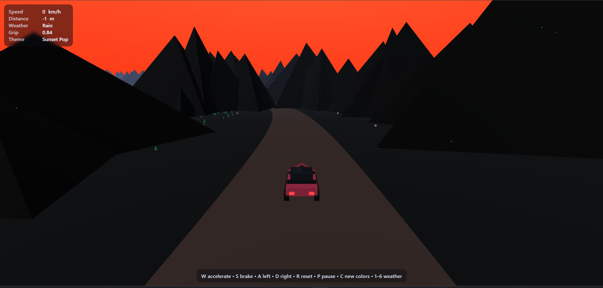

[README_Version3.md](https://github.com/user-attachments/files/21705669/README_Version3.md)
# Endless Sage 7

[Live Demo](https://endlesssaga.vercel.app/)  
A minimalist, endless driving game rendered in 3D graphics.

---

## Stack

- **HTML** — UI and game structure.
- **JavaScript (ES6 Modules)** — Game logic, controls, physics, and rendering.
- **THREE.js** — 3D rendering engine (imported via CDN).
- **WebGL** — Hardware-accelerated graphics via THREE.js.
- **CSS** — Custom inlined styles for UI overlays and banners.

---

## Features

- **Endless Procedural Road:** Infinite, smoothly-generated road with curves and elevation changes.
- **Low-Poly 3D Graphics:** Stylish, minimalist polygonal artwork.
- **Multiple Themes:** Choose from Neon Night, Aurora, and Sunset Pop. Each with unique sky, road, and mountain palettes.
- **Dynamic Weather:** Clear, Rain, Storm, Sunset, Cloudy, and Night with visual and gameplay changes (affecting grip).
- **Obstacles & Terrain:** Dodge boxes, cones, and navigate through mountains, grass, and sand.
- **Responsive HUD:** Real-time speed, distance, weather, grip, and theme display.
- **Keyboard Controls:**  
  - `W` accelerate  
  - `S` brake  
  - `A` left  
  - `D` right  
  - `R` reset  
  - `P` pause  
  - `C` cycle colors/themes  
  - `1–6` change weather

---

## How to Play

Drive as far as you can along a procedurally-generated road.  
Avoid obstacles and stay on the road—going off-road or hitting objects ends the game.

---

## Screenshots

Aurora Theme (Rainy Night):  


Sunset Pop Theme (Rainy Evening):  


---

## Project Structure

- `index.html` — Main game entry point and all logic (single file).
- All code inlined (modular JS, CSS, and HTML in one file).
- No dependencies except [THREE.js](https://threejs.org/) via CDN.

---

## Setup

1. Clone this repository:
    ```bash
    git clone https://github.com/HarishNeralla2006/endless-sage7.git
    ```
2. Open `index.html` in your browser.

Or play instantly: [https://endlesssaga.vercel.app/](https://endlesssaga.vercel.app/)

---

## Credits

Created by [HarishNeralla2006](https://github.com/HarishNeralla2006).

---

*For feedback or contributions, please create an issue or pull request.*
